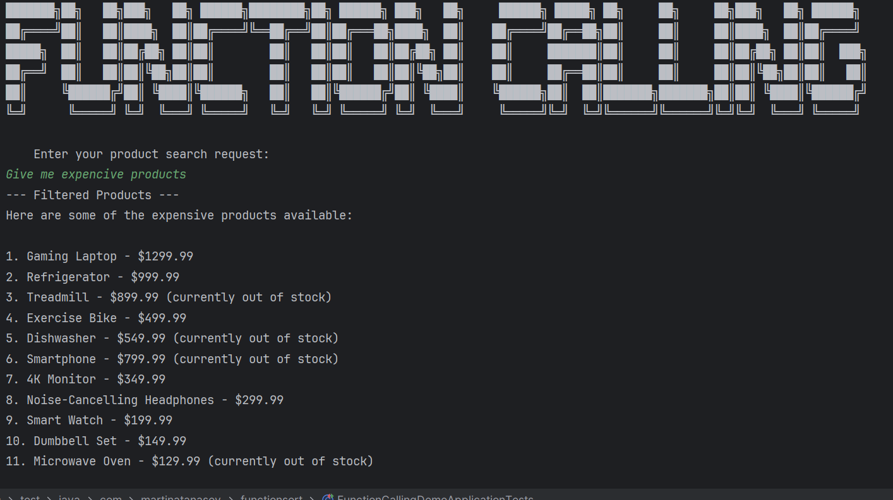

# 🧠 Function Calling – AI-Based Product Filter Console App

**Function Calling** is a Java 17, Spring Boot console application that leverages **OpenAI's Function Calling (Tool Calling)** through **Spring AI** to intelligently filter and return products based on natural language user input.

Instead of writing filtering logic manually, this app sends the product list and user preferences to OpenAI GPT, which interprets and applies the filtering via its AI reasoning.

---

## 🚀 Features

* ✅ Natural language product filtering (e.g., “I need cheap electronics in stock”)
* ✅ Uses **OpenAI Tool Calling** to interpret user input and apply filters
* ✅ Fully console-based app (no UI or REST)
* ✅ Loads raw product data from `products.json`
* ✅ Built with:

    * Java 17 (OpenJDK)
    * Spring Boot
    * Spring AI 1.0+
    * OpenAI GPT-4 (function-calling capable)
    * Lombok (for model simplification)

---

## 📦 Requirements

| Tool           | Version      |
| -------------- | ------------ |
| Java           | 17 (OpenJDK) |
| Maven          | 3.8+         |
| Spring Boot    | 3.2+         |
| Spring AI      | 1.0+         |
| OpenAI API Key | ✅ Required   |

---


## ⚙️ Setup Instructions

### 1. Clone the repository

```bash
git clone https://github.com/your-username/function-calling-java.git
cd function-calling-java
```

### 2. Build the project

```bash
./mvnw clean install
```

### 3. Run the application

```bash
./mvnw spring-boot:run
```

Or run the compiled jar:

```bash
java -jar target/function-calling-0.0.1-SNAPSHOT.jar
```

### 4. Enter prompts in the terminal

You'll be prompted to:

* Enter your **OpenAI API key**
* Enter your **product filter query** (natural language)

Example:

```text
Enter your OpenAI API key: sk-...
Enter your product search query: Show me electronics under $300 that are in stock and highly rated
```

---

## 📄 Sample Output

```
--- Filtered Products ---
1. Wireless Headphones - $99.99, Rating: 4.5, In Stock
2. Smart Watch - $199.99, Rating: 4.6, In Stock
```

---

## 📘 Notes

* The product list is loaded from `products.json` in `src/main/resources`.
* OpenAI function calling is used to match user input with appropriate filters.
* No filtering logic is performed manually in Java — all handled by GPT.

---

## 🧪 Testing Product Input

Edit `products.json` to test with your own data:

```json
[
  { "name": "Wireless Headphones", "category": "Electronics", "price": 99.99, "rating": 4.5, "in_stock": true },
  { "name": "Gaming Laptop", "category": "Electronics", "price": 1299.99, "rating": 4.8, "in_stock": false },
  { "name": "Smart Watch", "category": "Electronics", "price": 199.99, "rating": 4.6, "in_stock": true }
]
```

---

## 💬 Example Prompts

* `I want cheap electronics in stock`
* `Give me all fitness gadgets under $150`
* `Books with 4.7+ rating that are available`

---

## 📖 Learn More

* [Spring AI Documentation](https://docs.spring.io/spring-ai/reference/)
* [OpenAI Tool Calling Guide](https://platform.openai.com/docs/guides/function-calling)
* [Lombok](https://projectlombok.org/)
* [Spring Boot](https://spring.io/projects/spring-boot)

---

Let me know if you'd like a version of this as a `README.md` file download or with GitHub Actions support.


## 🚀 How to Run

1. Clone the repository.
2. Set your OpenAI API key as an environment variable:
3. Run the required script with your API key instead of <enter_your_api_key>

bash
```bash
./mvnw spring-boot:run -Dspring-boot.run.jvmArguments="-Dspring.ai.openai.api-key=<enter_your_api_key>"
```

cmd
```cmd
mvnw spring-boot:run -Dspring-boot.run.jvmArguments="-Dspring.ai.openai.api-key=<enter_your_api_key>"
```

## 🔍 Service Analyzer Preview

