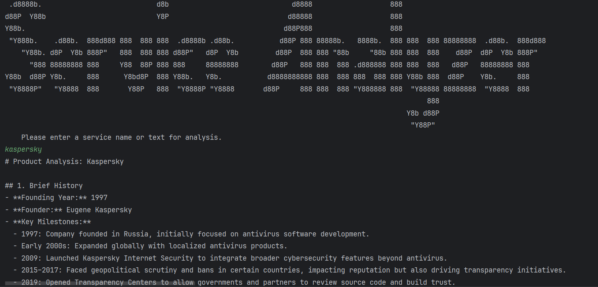

# Service Analyzer

**Service Analyzer** is a lightweight AI-powered console application built with Java and Spring Boot. It generates comprehensive, markdown-formatted reports from a service name or raw product description text. Designed for quick insights from business, technical, and user perspectives, the tool is ideal for product managers, investors, analysts, and developers.

---

## 🛠️ Technologies Used

- Java 17+ (OpenJDK)
- Maven
- Spring Boot
- Spring AI (OpenAI integration)
- Lombok

---

## 📋 Requirements

- Java 17 or newer (recommended: OpenJDK 17+)
- OpenAI API key (for AI processing)

---

## 🚀 How to Run

1. Clone the repository.
2. Set your OpenAI API key as an environment variable:
3. Run the required script with your API key

bash
```bash
./mvnw spring-boot:run -Dspring-boot.run.jvmArguments="-Dspring.ai.openai.api-key=<enter_your_api_key>"
```

cmd
```cmd
mvnw spring-boot:run -Dspring-boot.run.jvmArguments="-Dspring.ai.openai.api-key=<enter_your_api_key>"
```

## 🔍 Service Analyzer Preview


